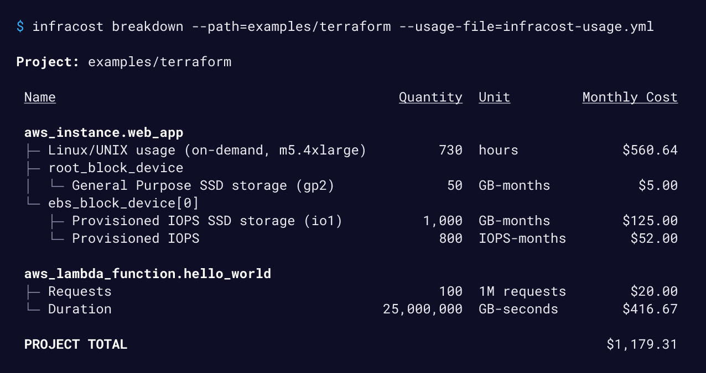
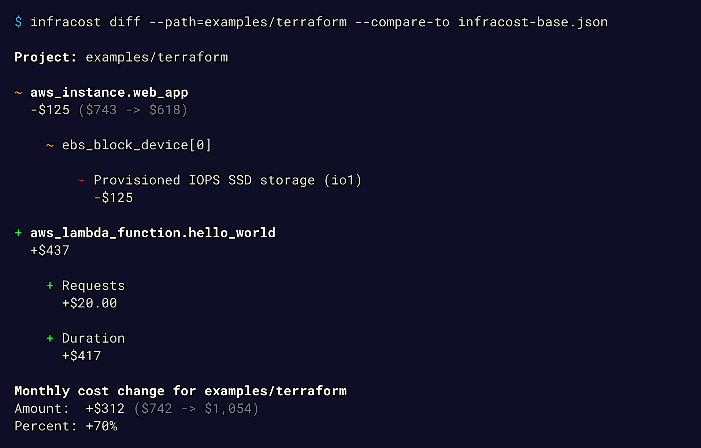

Diginfra shows cloud cost estimates and FinOps best practices for Terraform. It lets engineers see a cost breakdown and understand costs <b>before making changes</b>, either in the terminal, VS Code or pull requests.

## Get started

Follow our [**quick start guide**](https://www.diginfra.khulnasoft.com/docs/#quick-start) to get started 🚀

Diginfra also has many CI/CD integrations so you can easily post cost estimates in pull requests. This provides your team with a safety net as people can discuss costs as part of the workflow.

#### Post cost estimates in pull requests

#### Output of `diginfra breakdown`

#### `diginfra diff` shows diff of monthly costs between current and planned state

#### Diginfra Cloud

[Diginfra Cloud](https://www.diginfra.khulnasoft.com/docs/diginfra_cloud/get_started/) is our SaaS product that builds on top of Diginfra open source and works with CI/CD integrations. It enables you to check for best practices such as using latest generation instance types or block storage, e.g. consider switching AWS gp2 volumes to gp3 as they are more performant and cheaper. Team leads, managers and FinOps practitioners can also setup [tagging policies](https://www.diginfra.khulnasoft.com/docs/diginfra_cloud/tagging_policies/) and [guardrails](https://www.diginfra.khulnasoft.com/docs/diginfra_cloud/guardrails/) to help guide the team.

## Supported clouds and resources

Diginfra supports over **1,100** Terraform resources across [AWS](https://www.diginfra.khulnasoft.com/docs/supported_resources/aws), [Azure](https://www.diginfra.khulnasoft.com/docs/supported_resources/azure) and [Google](https://www.diginfra.khulnasoft.com/docs/supported_resources/google). Other IaC tools, such as [Pulumi](https://github.com/diginfra/diginfra/issues/187), [AWS CloudFormation/CDK](https://github.com/diginfra/diginfra/issues/190) and [Azure ARM/Bicep](https://github.com/diginfra/diginfra/issues/812) are on our roadmap.

Diginfra can also estimate [usage-based resources](https://www.diginfra.khulnasoft.com/docs/usage_based_resources) such as AWS S3 or Lambda!

## Community and contributing

Join our [community Slack channel](https://www.diginfra.khulnasoft.com/community-chat) to learn more about cost estimation, Diginfra, and to connect with other users and contributors. Checkout the [pinned issues](https://github.com/diginfra/diginfra/issues) for our next community call or [our YouTube](https://www.youtube.com/playlist?list=PLZHI9QofNPJQS9Hz0P5zfsl0AC03llbMY) for previous calls.

We ❤️ contributions big or small. For development details, see the [contributing](CONTRIBUTING.md) guide. For major changes, including CLI interface changes, please open an issue first to discuss what you would like to change.

Thanks to all the people who have contributed, including bug reports, code, feedback and suggestions!

## License

[Apache License 2.0](https://choosealicense.com/licenses/apache-2.0/)
